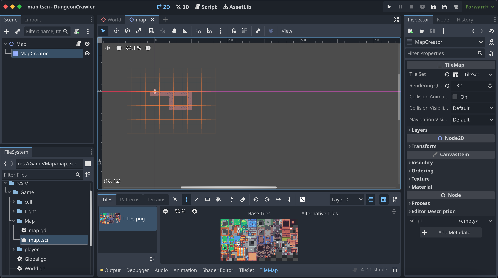

# DungeonCrawler: A Godot 4 Asset for Basic Dungeon Crawler Mechanics

DungeonCrawler is a valuable asset for Godot 4, designed to empower developers with fundamental dungeon crawler mechanics, including movement and dungeon generation.

This repository is a port of the original project hosted at [uheartbeast/3d-dungeon](https://github.com/uheartbeast/3d-dungeon) tailored for Godot 4.

## How to Run
1. Incorporate "Global.gd" into the autoloader located at `Game/Global.gd`.
2. Launch "World.tscn".

## Dungeon Generation Guide
To generate a dungeon, utilize the tile map found at `Game/Map/map.tscn`. 
Simply add any box to initiate the creation of a 3D dungeon cell (`Game/cell/cell.tscn`).

